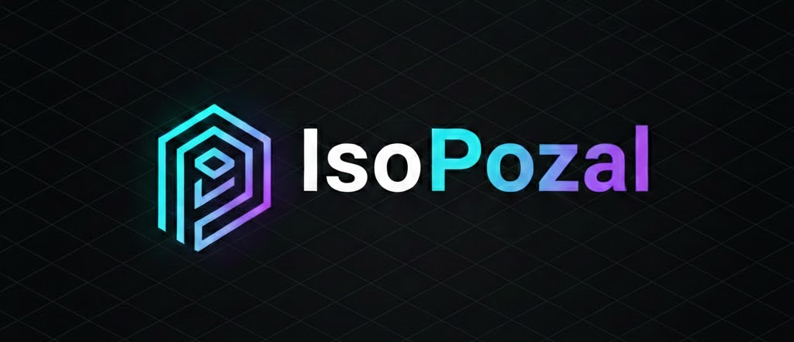
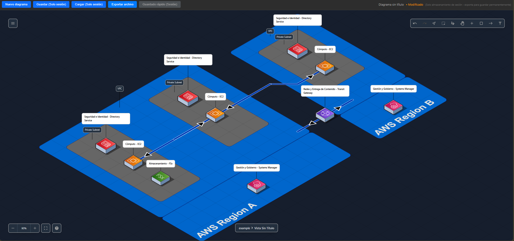

# IsoPozal - Diagramador de Arquitectura AWS

<p align="center">
  
</p>

<p align="center">
  <strong>Herramienta web gratuita y de código abierto para crear diagramas de arquitectura AWS</strong>
</p>

<p align="center">
  <a href="https://github.com/danielibabet/isopozal">
    
  </a>
  <a href="https://github.com/danielibabet/isopozal/blob/main/LICENSE">
    
  </a>
  
</p>

---

## Capturas de Pantalla

<p align="center">
  
  <br/>
  <em>Interfaz principal de IsoPozal</em>
</p>

## ¿Qué es IsoPozal?

IsoPozal es una herramienta especializada para crear diagramas de arquitectura AWS de manera rápida, intuitiva y profesional. Basada en el excelente proyecto open source [FossFLOW](https://github.com/stan-smith/FossFLOW), IsoPozal está completamente adaptada para la comunidad hispanohablante con recursos oficiales de AWS.

La aplicación funciona completamente en el navegador, sin necesidad de servidores backend, garantizando privacidad total y funcionamiento offline una vez cargada.

### Características Principales

- **Iconos Oficiales AWS**: Set completo de 307 iconos de servicios AWS organizados en 24 categorías
- **100% en Español**: Interfaz completamente traducida al español con i18n
- **Categorías Organizadas**: Servicios organizados en categorías traducidas (Cómputo, Base de Datos, Redes, Analítica, etc.)
- **Búsqueda Inteligente**: Búsqueda en tiempo real de servicios AWS con filtrado por categoría
- **Tema Oscuro**: Interfaz profesional con paleta de colores oscuros optimizada
- **Privacidad Total**: Todo el procesamiento se realiza en el navegador. Sin servidores, sin tracking
- **Múltiples Formatos**: Exporta tus diagramas como JSON, PNG, SVG o PDF
- **Rápido e Intuitivo**: Dibuja diagramas isométricos profesionales en minutos
- **Progressive Web App**: Funciona offline una vez cargada (Service Worker incluido)
- **Glosario Integrado**: Descripciones en español de todos los servicios AWS

## Inicio Rápido

### Usar Online

Visita **[https://danielibabet.github.io/isopozal](https://danielibabet.github.io/isopozal)** y empieza a crear diagramas inmediatamente.

### Instalación Local

```bash
# Clonar el repositorio
git clone https://github.com/danielibabet/isopozal.git
cd isopozal

# Instalar dependencias
npm install

# Construir la librería (requerido la primera vez)
npm run build:lib

# Iniciar servidor de desarrollo
npm run dev
```

La aplicación se abrirá automáticamente en tu navegador en [http://localhost:3000](http://localhost:3000).

### Requisitos del Sistema

- Node.js >= 18.0.0
- npm >= 9.0.0

## Cómo Usar

### Crear Diagramas

1. **Añadir Componentes**:
   - Haz clic en el botón "+" en el menú superior derecho
   - Arrastra y suelta componentes desde la biblioteca a la izquierda
   - O haz clic derecho en el canvas y selecciona "Añadir nodo"

2. **Conectar Componentes**:
   - Selecciona la herramienta Conector (presiona 'C' o haz clic en el icono)
   - Haz clic en el primer nodo, luego en el segundo nodo
   - Personaliza las flechas con etiquetas, colores y estilos

3. **Personalizar**:
   - Haz clic en cualquier elemento para ver sus opciones
   - Cambia colores, tamaños, etiquetas y más
   - Añade cajas de texto para documentación adicional

4. **Guardar tu Trabajo**:
   - **Guardado Rápido**: Guarda en la sesión del navegador
   - **Exportar**: Descarga como archivo JSON
   - **Exportar Imagen**: Descarga como PNG, SVG o PDF

### Atajos de Teclado

| Atajo | Acción |
|-------|--------|
| `Ctrl + Z` | Deshacer |
| `Ctrl + Y` / `Ctrl + Shift + Z` | Rehacer |
| `C` | Herramienta Conector |
| `T` | Herramienta Texto |
| `R` | Herramienta Rectángulo |
| `Delete` | Eliminar elemento seleccionado |
| `Espacio + Arrastrar` | Mover canvas |
| `Ctrl + Rueda` | Zoom |

## Recursos Incluidos

- **307 Iconos de Servicios AWS** organizados en 24 categorías:
  - Analytics, App Integration, Blockchain, Business Applications
  - Cloud Financial Management, Compute, Containers, Customer Enablement
  - Database, Developer Tools, End User Computing, Front-End Web & Mobile
  - Games, General Icons, Internet of Things, Machine Learning
  - Management & Governance, Media Services, Migration & Transfer
  - Networking & Content Delivery, Quantum Technologies, Robotics
  - Satellite, Security Identity & Compliance, Storage, VR & AR
- **Glosario de Servicios**: Consulta [GLOSARIO_AWS.md](GLOSARIO_AWS.md) para descripciones en español de cada servicio

## Estructura del Proyecto

Este es un monorepo que contiene dos paquetes:

- `packages/fossflow-lib` - Librería React para dibujar diagramas (construida con RSLib)
- `packages/fossflow-app` - Progressive Web App que envuelve la librería (construida con RSBuild)

### Tecnologías Utilizadas

- **React 19** - Framework de UI
- **TypeScript 5.9** - Tipado estático
- **RSBuild** - Build tool para la aplicación
- **RSLib** - Build tool para la librería
- **Material-UI (MUI)** - Componentes de UI
- **Paper.js** - Renderizado de gráficos vectoriales
- **i18next** - Internacionalización
- **Zustand** - Gestión de estado
- **GSAP** - Animaciones

### Comandos de Desarrollo

```bash
# Desarrollo
npm run dev          # Iniciar servidor de desarrollo (puerto 3000)
npm run dev:lib      # Modo watch para desarrollo de librería

# Construcción
npm run build        # Construir librería y app para producción
npm run build:lib    # Construir solo librería
npm run build:app    # Construir solo app

# Testing y Linting
npm test             # Ejecutar tests unitarios
npm run lint         # Verificar errores de linting

# Limpieza
npm run clean        # Limpiar archivos de build
```

### Estructura de Carpetas

```
isopozal/
├── packages/
│   ├── fossflow-lib/          # Librería React
│   │   ├── src/
│   │   │   ├── components/    # Componentes React
│   │   │   ├── models/        # Modelos de datos
│   │   │   ├── services/      # Servicios y utilidades
│   │   │   └── index.ts       # Punto de entrada
│   │   └── package.json
│   └── fossflow-app/          # Progressive Web App
│       ├── public/
│       │   ├── i18n/          # Traducciones
│       │   └── pngs/          # Iconos AWS
│       ├── src/
│       │   ├── components/    # Componentes de la app
│       │   └── App.tsx        # Componente principal
│       └── package.json
├── GLOSARIO_AWS.md            # Glosario de servicios AWS
├── CHANGELOG.md               # Historial de cambios
└── package.json               # Configuración del monorepo
```

## Cambios Respecto a FossFLOW Original

### Añadido

- **Traducción completa al español** de toda la interfaz usando i18next
- **307 iconos oficiales de AWS** organizados en 24 categorías
- **Categorías en español** para servicios AWS
- **Glosario de servicios AWS** en español (GLOSARIO_AWS.md)
- **Tema oscuro optimizado** para trabajo profesional
- **Búsqueda mejorada** de iconos con filtrado en tiempo real
- **Service Worker** para funcionamiento offline
- **Selector rápido de iconos** en controles de nodo
- **Migración a RSBuild/RSLib** desde Webpack

### Eliminado

- Configuración de Docker (no necesaria para uso web)
- Tests E2E (simplificación del proyecto)
- Workflows de GitHub Actions originales
- Carpetas de SVG no utilizadas
- Sistema de "Iconos Usados Recientemente"
- Funcionalidad de importar iconos personalizados
- Backend de Node.js (no necesario)

### Modificado

- **Nombre del proyecto**: FossFLOW → IsoPozal
- **Versión**: 1.0.1
- **Repositorio**: https://github.com/danielibabet/isopozal
- **Idioma por defecto**: Español (era inglés)
- **Nombre de exportación**: isopozal-export (era fossflow-export)
- **Build tools**: Webpack → RSBuild/RSLib
- **React**: Actualizado a v19

## Documentación Adicional

- [GLOSARIO_AWS.md](GLOSARIO_AWS.md) - Glosario de servicios AWS en español
- [CHANGELOG.md](CHANGELOG.md) - Historial de cambios del proyecto
- [DEPLOYMENT.md](DEPLOYMENT.md) - Guía de deployment a GitHub Pages

## Estado del Proyecto

IsoPozal está en desarrollo activo. La versión actual (1.0.1) incluye todas las funcionalidades básicas para crear diagramas de arquitectura AWS profesionales.

### Próximas Funcionalidades

- Exportación a formatos adicionales (Terraform, CloudFormation)
- Plantillas predefinidas de arquitecturas comunes
- Colaboración en tiempo real
- Integración con AWS para importar arquitecturas existentes

## Créditos

IsoPozal está basado en [FossFLOW](https://github.com/stan-smith/FossFLOW) creado por [@stan-smith](https://github.com/stan-smith).

FossFLOW a su vez está construido sobre la librería [Isoflow](https://github.com/markmanx/isoflow) creada por [@markmanx](https://github.com/markmanx).

Los iconos de AWS son propiedad de Amazon Web Services y se utilizan bajo sus términos de uso.

### Apoya el Proyecto Original

Si te ha gustado IsoPozal, considera apoyar también a los creadores originales:

- **FossFLOW**: [Buy Me a Coffee](https://www.buymeacoffee.com/stan.smith) | [Ko-fi](https://ko-fi.com/P5P61KBXA3)

## Contribuciones

Las contribuciones son bienvenidas. Si encuentras un bug o tienes una sugerencia:

1. Abre un [issue](https://github.com/danielibabet/isopozal/issues)
2. Haz un fork del proyecto
3. Crea una rama para tu feature (`git checkout -b feature/AmazingFeature`)
4. Commit tus cambios (`git commit -m 'Add some AmazingFeature'`)
5. Push a la rama (`git push origin feature/AmazingFeature`)
6. Abre un Pull Request

## Licencia

MIT License - Ver [LICENSE](LICENSE) para más detalles.

---

<p align="center">
  Hecho con amor para la comunidad hispanohablante de AWS
</p>

<p align="center">
  <a href="https://github.com/danielibabet/isopozal">Dale una estrella en GitHub</a>
</p>
