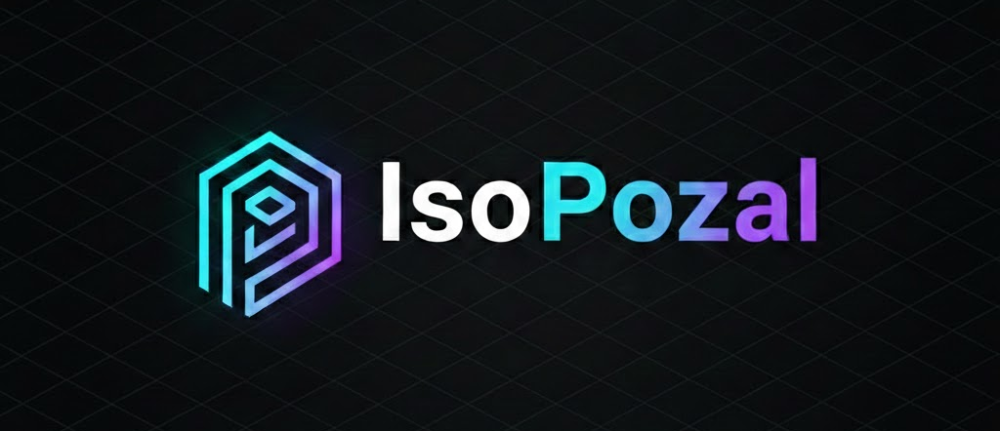
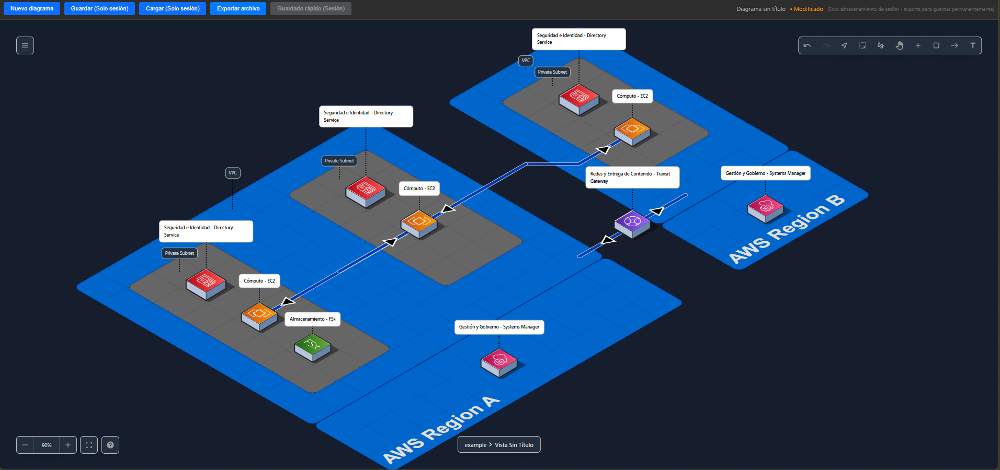

# IsoPozal - AWS Architecture Isometric Diagrammer

<p align="center">
  
</p>

<p align="center">
  
  
  
  
  
</p>

<p align="center">
  <a href="https://danielibabet.github.io/isopozal/">
    
  </a>
</p>

<p align="center">
  <a href="https://buymeacoffee.com/dibanezb">
    
  </a>
</p>

IsoPozal is a free and open-source web application to build isometric cloud architecture diagrams with official AWS icons, full Spanish localization, and instant diagram export.

> 🌐 **Try it online now without installation:** [danielibabet.github.io/isopozal](https://danielibabet.github.io/isopozal/)

---

## Interface Preview

<p align="center">
  
  <br/>
  <em>Main IsoPozal interactive diagramming interface</em>
</p>

---

## Features

- **Isometric Canvas:** Professional isometric grid with smooth snapping, connecting arrows, and custom text labels.
- **300+ Official AWS Icons:** Fully categorized across Compute, Storage, Database, AI/ML, Networking, Security, and more.
- **Lightning Fast:** Powered by **RSBuild** and **RSlib** for ultra-fast compilation and runtime performance.
- **Offline PWA Support:** Service Worker caching for seamless offline architecture designing.
- **Export Options:** Export clean vector-ready SVG/PNG diagrams directly from your browser.

---

## Quick Start

```bash
# Install dependencies
npm install

# Start development server
npm run dev

# Build for production
npm run build
```

---

## Support & Author

- **Daniel Ibáñez** - [@danielibabet](https://github.com/danielibabet)
